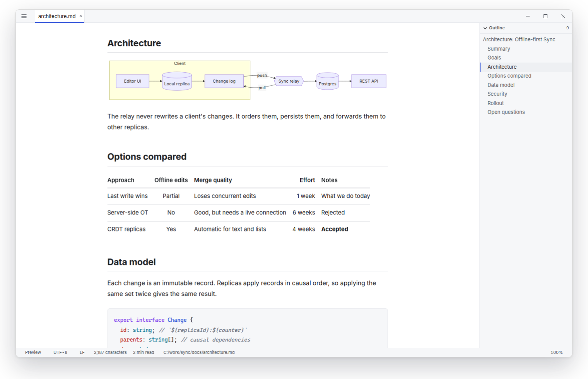
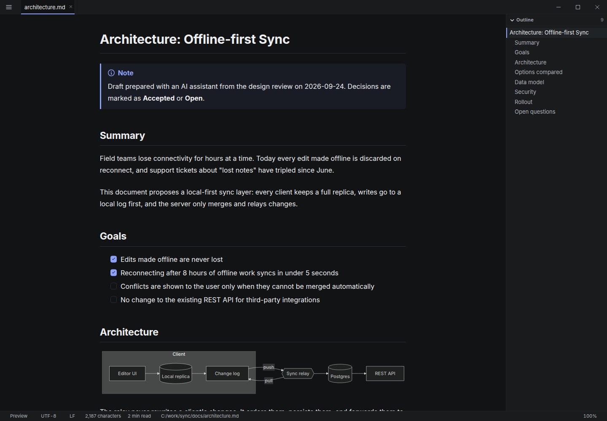
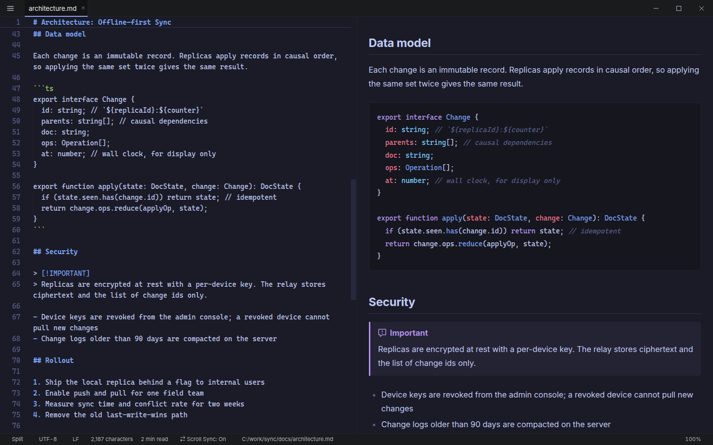
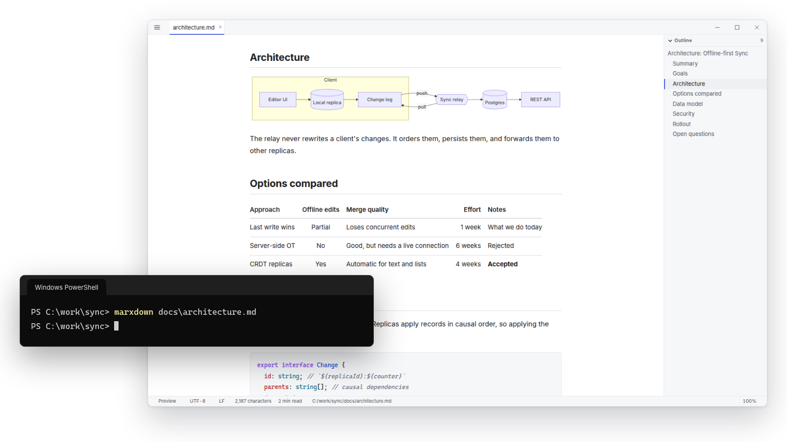
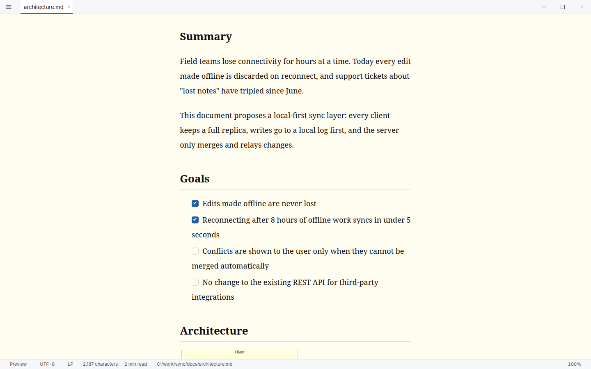

<div align="center">

<picture>
  <source media="(prefers-color-scheme: dark)" srcset="assets/logo-dark.svg" />
  
</picture>

## Don't open VS Code just to read a Markdown file.

Marxdown is a fast, reading-first Markdown viewer for Windows.<br />
Open a `.md` file, read it comfortably, and edit it when you need to.

[**⬇ Download for Windows**](https://github.com/antimacho612/marxdown/releases/latest) ·
[Website](https://antimacho612.github.io/marxdown/en/) ·
[Guide](https://antimacho612.github.io/marxdown/en/guide/)

Free and open source (MIT) · Windows 10 / 11 (x64)

[日本語](README.md) | English

</div>

<br />



## Why Marxdown?

Markdown is everywhere.
READMEs. Design documents. Meeting notes. Research an AI wrote for you. Architecture decisions.

And sometimes, opening a full IDE just to read one `.md` file feels like too much.

Marxdown is built for that moment.
Open it. Read it. Edit it if you need to. Close it.

## VS Code is great. Marxdown is different.

VS Code is a powerful development environment.
Marxdown is for the moments when you don't need one.

If you just want to open a Markdown file, read it, and maybe fix a typo, Marxdown keeps that simple:

- It opens in a **reading view**, not in an editor tab with a preview on the side
- There is no workspace to load, and no extensions to wait for
- After the first launch it waits in the system tray, so the next `marxdown README.md` opens as a tab almost immediately
- When you do want to edit, the editor is Monaco, the same editor VS Code uses

The idea is to use both: VS Code for writing code, Marxdown for reading what is written about it.

## Especially useful for AI-generated Markdown

AI tools increasingly answer in Markdown:
architecture documents, research notes, meeting summaries, implementation plans, code reviews, project documentation.

You spend more time reading Markdown than writing it.
Marxdown gives those documents a dedicated place to be read.

```bash
marxdown docs/                       # Open the folder your agent wrote into, with a file list
llm "Draft a design" | marxdown -    # Read a command's output as a rendered document
```

Tables, code, math, and Mermaid diagrams are rendered as they are.
And because AI output is Markdown you didn't write yourself, Marxdown never runs scripts embedded in a document (see [Privacy & security](#privacy--security)).

## What it feels like

<table>
  <tr>
    <td width="50%"></td>
    <td width="50%"></td>
  </tr>
  <tr>
    <td><b>Read.</b> Long documents with an outline, comfortable line length, and dark mode.</td>
    <td><b>Edit when you need to.</b> One key switches to Split, and the preview follows as you type.</td>
  </tr>
  <tr>
    <td width="50%"></td>
    <td width="50%"></td>
  </tr>
  <tr>
    <td><b>Open from your terminal.</b> The prompt comes back right away.</td>
    <td><b>Make it yours.</b> Font, size, line height, and text width.</td>
  </tr>
</table>

## Features

### Read

- **Opens in a reading view.** Typography with balanced margins, line height, and text width keeps long documents easy to read
- **Renders what developers write.** Tables, syntax-highlighted code, math (KaTeX), Mermaid diagrams, GitHub alerts (`> [!NOTE]`), task lists, and footnotes
- **Find your way around.** Jump to headings from the Outline, and search inside the preview

### Open quickly

- **Open Markdown from your terminal.** Run `marxdown README.md` and start reading. cmd.exe, PowerShell, and Git Bash all get their prompt back immediately
- **Every next file opens as a tab.** After the first launch Marxdown waits in the system tray, using almost no CPU
- **Double-click works too.** `.md` / `.markdown` files are associated with Marxdown, and folders get an "Open with Marxdown" menu

### Edit when you need to

- **One key from reading to writing.** Switch between Preview, Edit, and Split
- **Saving changes only what you changed.** Line endings, the BOM, and the final newline stay as they were when opened
- **Stays in sync.** When another app (or your AI agent) rewrites the file, Marxdown reloads it

### Work with folders

- **Open a whole folder.** `marxdown docs/` shows a file list next to the document
- **Find files by name** with <kbd>Ctrl</kbd>+<kbd>P</kbd>, and run every action from the Command Palette (<kbd>Ctrl</kbd>+<kbd>Shift</kbd>+<kbd>P</kbd>)

### Make long documents comfortable to read

Markdown is often read for minutes or hours, not seconds. So typography matters.

- Text and code fonts, font size, line height, text width, and table borders
- Light, dark, or follow Windows
- **50 built-in color themes**, plus your own by dropping a CSS file into the `themes` folder

<table>
  <tr>
    <td width="33%"></td>
    <td width="33%"></td>
    <td width="33%"></td>
  </tr>
  <tr>
    <td width="33%"></td>
    <td width="33%"></td>
    <td width="33%"></td>
  </tr>
</table>

### Also included

- Export the document you are viewing as HTML or PDF
- Documents with `marp: true` are shown as [Marp](https://marp.app/) slides
- Definition lists, highlights, superscript, subscript, and more can be enabled in Settings
- English and Japanese UI (follows the Windows display language by default)
- In-app update notifications

## How it compares

Every tool below is good at what it was built for. This table is about what each one is built around, not about which is better.

| | Marxdown | VS Code | Typora | Obsidian |
| --- | --- | --- | --- | --- |
| Built around | Reading Markdown files, with light editing | Writing and debugging code | Writing Markdown (WYSIWYG) | A personal knowledge base of linked notes |
| Opens a single file as is | ✓ | ✓ | ✓ | Files live in a vault |
| Editing style | Source editor (Monaco) with Preview / Split | Source editor with a preview pane | WYSIWYG | Live Preview, source, and Reading view |
| Platforms | Windows only | Windows, macOS, Linux | Windows, macOS, Linux | Windows, macOS, Linux, mobile |
| Price | Free, open source (MIT) | Free | Paid (one-time license, free trial) | Free (commercial license optional) |

If you write long-form Markdown, Typora is a great fit. If you build a network of notes, Obsidian is. If you live in a codebase, VS Code is.
Marxdown is for opening the file in front of you and reading it.

## Installation

1. Download `Marxdown_<version>_x64-setup.exe` from [**Releases**](https://github.com/antimacho612/marxdown/releases/latest)
2. Run it. No administrator rights are needed (it installs to `%LOCALAPPDATA%\Marxdown`)
3. At the end, choose **Yes** to "Make the marxdown command available from the terminal?"

That's it. Double-click any `.md` file, or type `marxdown README.md`.

> [!NOTE]
> Windows may show a SmartScreen warning ("Windows protected your PC") because the installer is currently unsigned.
> Choose "More info" and then "Run anyway" to continue.

When a new version is released, Marxdown tells you in the app, and "Update and Restart" installs it.
See the [CHANGELOG](CHANGELOG.md) for what changed.

<details>
<summary>WebView2 Runtime</summary>

<br />

It is included in Windows 11.
On systems without it (some Windows 10 installations), the installer downloads it, so an internet connection is required.

</details>

<details>
<summary>Silent installation</summary>

<br />

`/S` installs without prompts. Add `/ADDTOPATH` to also add the command to PATH.
When updating, the previous choice is kept.

```powershell
.\Marxdown_<version>_x64-setup.exe /S /ADDTOPATH
```

</details>

<details>
<summary>Uninstallation</summary>

<br />

Uninstall Marxdown from "Settings > Apps > Installed apps".
File associations and PATH are restored.
To also delete your settings and recent file history, check "Delete the application data" on the uninstall screen.

</details>

## Command line

```bash
marxdown README.md                 # Open a file
marxdown README.md CHANGELOG.md    # Open several files as tabs
marxdown docs/                     # Open a folder with a file list
marxdown -m split notes.md         # Open in a view mode: preview | edit | split
llm "Draft a design" | marxdown -  # Open standard input as an untitled document
marxdown --help
```

A document opened from standard input is not saved yet. Save it with <kbd>Ctrl</kbd>+<kbd>Shift</kbd>+<kbd>S</kbd> to keep it.
When piping from Windows PowerShell 5.1, non-ASCII characters are replaced with `?` (this is how PowerShell works). PowerShell 7.4 and later are not affected.

> [!TIP]
> Closing the window with `✕` leaves Marxdown waiting in the system tray. That is why the next `marxdown` opens quickly.
> To quit completely, press <kbd>Ctrl</kbd>+<kbd>Q</kbd> or choose "Quit" from the tray menu.

### Main shortcuts

| Keys | Action |
| --- | --- |
| <kbd>Ctrl</kbd>+<kbd>Shift</kbd>+<kbd>V</kbd> | Switch between Preview and Edit |
| <kbd>Ctrl</kbd>+<kbd>\</kbd> | Split (editor and preview side by side) |
| <kbd>Ctrl</kbd>+<kbd>P</kbd> | Find and open a file in the folder |
| <kbd>Ctrl</kbd>+<kbd>Shift</kbd>+<kbd>P</kbd> | Command Palette |
| <kbd>Ctrl</kbd>+<kbd>,</kbd> | Settings |
| <kbd>Ctrl</kbd>+<kbd>Q</kbd> | Quit |

See [Keyboard Shortcuts](docs/keybindings.en.md) for the full list, and the [guide](https://antimacho612.github.io/marxdown/en/guide/) for the syntax and every setting.

## Privacy & security

- **Your files stay on your PC.** Marxdown has no account and no telemetry, and it does not upload your documents anywhere
- **Works offline.** Rendering, including Mermaid diagrams and math, runs locally. Images in a document that point to `https://` URLs are downloaded to display them, like in a browser
- **Update check.** At startup and when the window comes to the front, at most once a day, Marxdown asks GitHub Releases whether a new version exists. The request contains nothing about your files. Turn it off with "Check for Updates Automatically" (`update.autoCheck`) in Settings
- **Built for Markdown you didn't write.** Scripts in a document are never run, following a link never navigates the app away, and files outside the opened file's folder are not loaded unless you allow it

To report a vulnerability, see [SECURITY.md](SECURITY.md).

## Speed: what the numbers mean

Marxdown is built against a startup budget: **600 ms** for a cold start and **120 ms** when it is already waiting in the tray.
For you, that means opening a Markdown file without waiting for a full IDE to initialize, and every next file appearing as a tab right away.

These are design targets checked with the startup benchmarks on a release build (`pnpm bench:boot` for a cold start and `scripts/bench-startup.mjs --warm` for the tray case, each reporting the median of the startup phases), not a guarantee for every PC.
How to measure is described in [CONTRIBUTING.md](CONTRIBUTING.md#計測).

## Technical details


[](https://github.com/antimacho612/marxdown/actions/workflows/ci.yml)
[](https://github.com/antimacho612/marxdown/releases)
[](LICENSE)

- **App shell:** Tauri 2 (Rust) on WebView2. Single instance, system tray, file I/O that preserves encoding, line endings, and the BOM
- **UI:** Svelte 5 and TypeScript
- **Markdown pipeline:** markdown-it, sanitized with DOMPurify, under a strict Content Security Policy
- **Editor:** Monaco, loaded only when you first edit
- **Lazy loading:** the editor, Mermaid, KaTeX, and the syntax highlighter are loaded on demand, and the critical path has a bundle budget checked in CI

Build steps, checks, measurements, and the code structure are in [CONTRIBUTING.md](CONTRIBUTING.md) (in Japanese).

## Contributing

Bug reports and feature requests are welcome in [Issues](https://github.com/antimacho612/marxdown/issues/new/choose).
If you read Markdown every day, feedback on what gets in your way is especially helpful.

## License

[MIT](LICENSE)
