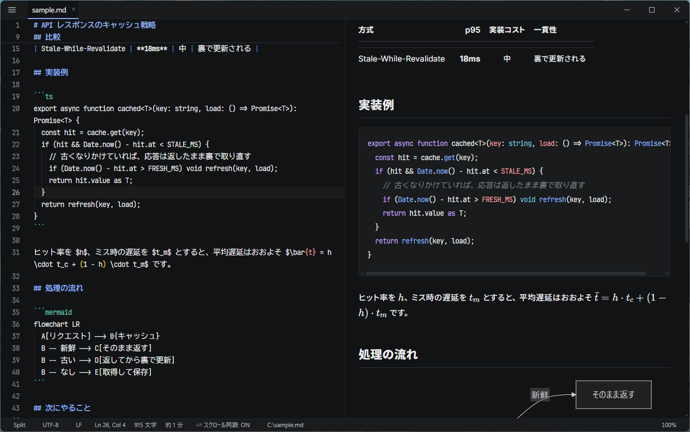

<picture>
  <source media="(prefers-color-scheme: dark)" srcset="assets/logo-dark.svg" />
  
</picture>

**Markdown を見る・書くなら、これ一択。**
速さと軽さを前提として持ったまま、体験の質で勝負するデスクトップアプリ。

`marxdown README.md` と打ってから本文が読めるまでの時間を、**常に満たす前提条件** として設計している。
常駐した 2 回目以降は WebView の初期化を払わずに開く。

速さは目標ではなく予算である。
その内側で、読む・書く体験の質に投資する（[ADR-0008](docs/adr/0008-value-priority.md)）。



## 何を解こうとしているか

LLM が Markdown を生成し、それをすぐ確認する。
この往復が 1 日に何十回も起きる。

VS Code は 2〜4 秒かかる。
1 ファイルを読むためだけに、ワークスペースと拡張機能が立ち上がる。
Marxdown はこのループのためだけに作る。

- **速く開く** — Cold Start ≤ 600ms、常駐中の Warm Start ≤ 120ms。**目標ではなく予算** として守る
- **Markdown が主役** — 見た目の既定値に投資する。読めることが機能である
- **調整できる** — 既定のまま完成しているが、テーマ・配色・フォント・本文幅で自分に合わせられる
- **信頼できない入力を前提にする** — 自分が書いていないファイルを開くのが中心ユースケース

## インストール

Windows 10 / 11（x64）向け。
macOS / Linux はビルドできる状態を保っているだけで、配布していない。

`Marxdown_<バージョン>_x64-setup.exe` を実行する。
ソースから作る場合は `pnpm build` で `src-tauri/target/release/bundle/nsis/` に出来る。

- 現在のユーザーにだけインストールされる（`%LOCALAPPDATA%\Marxdown`）。管理者権限は要らない
- `.md` / `.markdown` に関連付けられ、「プログラムから開く」にも Marxdown が出る
- WebView2 ランタイムは Windows 11 に標準で入っている。入っていない環境（一部の Windows 10）では、インストール中にダウンロードする。そのためネットワークが要る

### 「Windows によって PC が保護されました」と出たとき

インストーラにはコード署名をしていないため、ダウンロードした直後の初回実行で SmartScreen が止める（[ADR-0018](docs/adr/0018-no-code-signing.md)）。
「詳細情報」を押し、表示された「実行」を押すと続行できる。

### ターミナルから `marxdown` で開けるようにする

インストールの最後に「新しいターミナルから marxdown コマンドで開けるようにしますか？」と聞かれる。
「はい」を選ぶと、ユーザーの環境変数 PATH に `%LOCALAPPDATA%\Marxdown\bin` が追加される。
PATH の他のエントリは変更しない。

サイレントインストールでは `/ADDTOPATH` で指定する。
更新のときは前回の選択を引き継ぐ。

```powershell
.\Marxdown_0.1.0_x64-setup.exe /S /ADDTOPATH
```

### アンインストール

「設定 > アプリ > インストールされているアプリ」から Marxdown をアンインストールする。
関連付けと PATH のエントリは元に戻る。
設定と最近開いたファイルの履歴は残る。
消したい場合は、アンインストール画面の「アプリのデータを削除」にチェックを入れる。

## 使い方

```bash
marxdown README.md            # ファイルを開く
marxdown README.md CHANGELOG.md
marxdown docs/                # フォルダを開く（ファイルツリーとクイックオープンが使える）
marxdown -m split notes.md    # 表示モードを指定して開く: preview | edit | split
marxdown --help
```

cmd.exe / PowerShell / Git Bash のどれから実行しても、プロンプトはすぐに戻る。

**2 回目以降は、常駐しているウィンドウにタブとして開く。**
WebView の初期化を払わないため、1 回目よりずっと速い。
`✕` を押してもウィンドウはタスクトレイに入るだけで、プロセスは残る。
終了するには `Ctrl+Q` を押すか、トレイのメニューから「終了」を選ぶ。

エクスプローラーで `.md` をダブルクリックしても開ける。
別のアプリが既定になっている場合は、「プログラムから開く」で Marxdown を選ぶ。

| キー | 動作 |
| --- | --- |
| `Ctrl+Shift+V` | Preview と編集モードを切り替える |
| `Ctrl+\` | Split（編集とプレビューを並べる）を切り替える |
| `Ctrl+P` | フォルダ内の Markdown をあいまい検索して開く |
| `Ctrl+Shift+P` | コマンドパレット（すべての操作に届く） |
| `Ctrl+,` | 設定 |
| `Ctrl+Q` | 終了 |

キーバインドの一覧は [`docs/03.ux-spec/04-keybindings.md`](docs/03.ux-spec/04-keybindings.md) にある。

## 開発

Node 24 / pnpm 12 / Rust stable 1.80+ が要る。
パッケージマネージャは **pnpm**。

```bash
pnpm install
pnpm dev              # Tauri アプリを起動
```

### UI だけを速く回す

```bash
pnpm dev:web          # Vite のみ。Tauri を起動しない
```

Platform 層（`src/platform/`）がブラウザ用のモック実装を持っているため、UI の大部分は Tauri のビルドサイクルを待たずに開発できる。
起動時間・単一インスタンス・EOL/BOM の保持はこの経路では確認できない。

URL パラメータで挙動を切り替えられる。

| パラメータ | 効果 |
| --- | --- |
| `?welcome` | 引数なし起動（Welcome 画面）を再現する |
| `?file=<path>` | 仮想 FS 上のファイルを開く |

### コンポーネントの状態を並べて見る

```bash
pnpm storybook        # http://localhost:6006
```

通知バーの 3 段階も、履歴が空の Welcome も、実アプリでは特定の失敗を再現しないと見られない。
Storybook はそれを並べるためだけに入っている。

### 検査

```bash
pnpm check            # eslint + prettier --check + tsc --noEmit + svelte-check
pnpm fix              # eslint --fix + prettier --write
pnpm test             # Vitest
pnpm size             # バンドル予算のチェック
```

`tsc` は `.svelte` を読まないので、型チェックは `svelte-check` と 2 本立てになっている。

Rust 側は `src-tauri/` で `cargo fmt` / `cargo clippy --all-targets -- -D warnings` / `cargo test`。

### 計測

性能目標は [`docs/05.performance-budget/`](docs/05.performance-budget/README.md) にある。

```bash
pnpm fixtures                                  # bench/fixtures/ の基準ファイルを生成
pnpm bench                                     # Markdown パイプライン単体
pnpm build                                     # release ビルド（計測には必須）
pnpm bench:boot                                # Cold Start（T0〜T9 の中央値）
node scripts/bench-startup.mjs --warm          # Warm Start（単一インスタンス）
pnpm analyze && node scripts/analyze-chunks.mjs  # バンドルの内訳
```

基準ファイルは Git に入れていない（`huge.md` 2MB / `extreme.md` 10MB）。
`scripts/gen-fixtures.mjs` がシード固定で生成するので、誰の環境でも同じ内容になる。

アプリ自身にも計測が仕込んである。

```bash
marxdown --trace-startup out.json README.md    # T0〜T9 を JSON に書き出す
marxdown --trace-startup nul README.md         # 計測はするが書き出さない
```

### 自分で使う

Marxdown の最初の目標は「作っている本人が毎日使う」こと。
そのためには **ターミナルから `marxdown foo.md` と打てる** 必要がある。

```bash
pnpm build
```

`src-tauri/target/release/marxdown.exe` と、CLI シム（`src-tauri/target/release/bin/`）が出来る。
**PATH に通すのは `bin` のほうである。**

```powershell
# PowerShell（ユーザー環境変数に追記。1 回だけ）
$bin = Resolve-Path .\src-tauri\target\release\bin
[Environment]::SetEnvironmentVariable(
  'Path',
  [Environment]::GetEnvironmentVariable('Path', 'User') + ';' + $bin,
  'User'
)
```

新しいターミナルを開くと `marxdown README.md` が通る。

> **`target\release` を直接通さないこと。**
> そこにあるのは GUI の exe そのもので、cmd.exe と Git Bash は Marxdown を終了するまでプロンプトを返さない。
> `bin` のシムは起動を切り離してすぐに戻る。

> **release ビルドの出力を直接指している** のは意図的。
> インストーラ（`src-tauri/target/release/bundle/nsis/`）を入れると、ビルドのたびに再インストールが要る。
> `pnpm build` の出力をそのまま指しておけば、ビルドし直すだけで次の起動から新しい版になる。
> インストール版と両方を PATH に入れると、先に書かれているほうが使われる。

2 回目以降の `marxdown foo.md` は新しいプロセスを立てず、常駐しているプロセスにパスを転送する（単一インスタンス / ADR-0004）。
ここが速さの中心なので、**ドッグフーディングではウィンドウを閉じずに置いておく** のが本来の使い方。

## 構成

```text
src/
  app/            起動シーケンス・アプリシェル・計測
  features/       document / preview / editor / …
  markdown/       markdown-it パイプライン・サニタイズ
  platform/       Tauri API の唯一の呼び出し口（テスト時は差し替え）
  styles/         デザイントークンとプレビューのタイポグラフィ
                  （コンポーネント固有の CSS は各 .svelte の <style> に同居）
src-tauri/src/
  cli.rs          CLI 引数解析
  bootstrap.rs    起動時の先読みと初期ペイロード
  document/       読み書き（エンコーディング / EOL / 原子的書き込み）
  scope.rs        パスのスコープ検証
  trace.rs        起動計測
```

守っている不変条件は 4 つ。

1. **クリティカルパスを太らせない** — `main` + `shared` + `pipeline` + アプリの CSS の合計を 150KB (gzip) 以内に保つ。エディター・Mermaid・KaTeX・ハイライタはすべて遅延チャンク。
2. **Markdown テキストが唯一の真実** — AST も DOM も派生物で、テキストへ書き戻す経路を作らない。編集・保存で、触っていない箇所のバイト列を変えない。
3. **ドキュメント本体をリアクティブな状態に置かない** — 本文の DOM はコンポーネントツリーの外にある。
4. **Rust は速いことだけを担当する** — UI ロジックと Markdown の意味解釈は TypeScript 側。

設計の全体は [`docs/`](docs/README.md) にある（Git Submodule）。

## ライセンス

[MIT](LICENSE)
