<div align="center">

<picture>
  <source media="(prefers-color-scheme: dark)" srcset="assets/logo-dark.svg" />
  
</picture>

## Markdown を読むために、VS Code を開きたくない。

Marxdown は、Markdown を快適に読むことを中心に設計した Windows 向けの Markdown ビューアー／エディターです。<br />
`.md` を開いて読む。必要になったら、そのまま編集する。

[**⬇ Windows 版をダウンロード**](https://github.com/antimacho612/marxdown/releases/latest) ·
[Web サイト](https://antimacho612.github.io/marxdown/) ·
[ガイド](https://antimacho612.github.io/marxdown/guide/)

無料・オープンソース（MIT）· Windows 10 / 11（x64）

日本語 | [English](README.en.md)

</div>

<br />

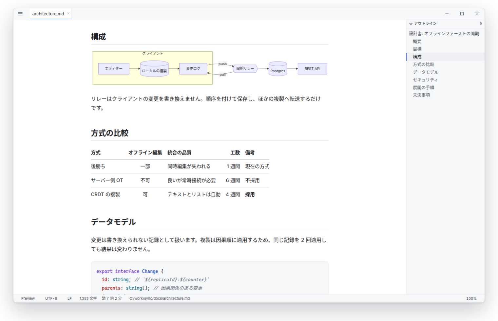

## なぜ Marxdown？

Markdown は、いたるところにあります。
README。設計書。議事録。AI にまとめてもらった調査。アーキテクチャの決定記録。

そして、`.md` を 1 つ読むためだけに IDE を立ち上げるのは、ときどき大げさに感じます。

Marxdown は、その瞬間のためのアプリです。
開いて、読んで、必要なら少し直して、閉じる。

## VS Code は素晴らしい。Marxdown は役割が違う。

VS Code は、強力な開発環境です。
Marxdown は、開発環境までは要らない場面のためにあります。

Markdown を開いて読み、ついでに誤字を 1 つ直したい。それだけなら、Marxdown のほうが手数が少なく済みます。

- 開くと、エディターのタブではなく **読むための表示** になります
- ワークスペースの読み込みも、拡張機能の起動待ちもありません
- 一度起動するとタスクトレイで待機するため、次の `marxdown README.md` はすぐにタブで開きます
- 書くときのエディターは、VS Code と同じ Monaco です

コードを書くのは VS Code、それについて書かれたものを読むのは Marxdown。そういう併用を想定しています。

## AI が生成した Markdown を読む

AI に設計、調査、議事録、レビューなどを頼むと、Markdown が返ってくることが増えました。
設計書、調査メモ、会議の要約、実装計画、コードレビュー、プロジェクトのドキュメント。

Markdown を書く時間より、読む時間のほうが長くなっています。
Marxdown は、そうして増えていく Markdown を「読む」ための場所として使えます。

```bash
marxdown docs/                          # エージェントが書き込んだフォルダーを、ファイル一覧と一緒に開く
llm "設計案を出して" | marxdown -        # コマンドの出力を、整った文書として読む
```

表・コード・数式・Mermaid の図も、そのまま表示します。
また、AI の出力は自分で書いていない Markdown なので、文書に埋め込まれたスクリプトは実行しません（[プライバシーとセキュリティ](#プライバシーとセキュリティ)）。

## 使ったときの見た目

<table>
  <tr>
    <td width="50%">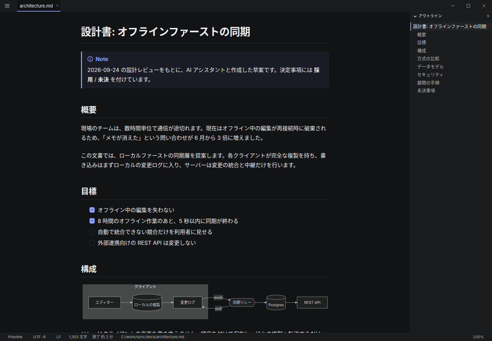</td>
    <td width="50%">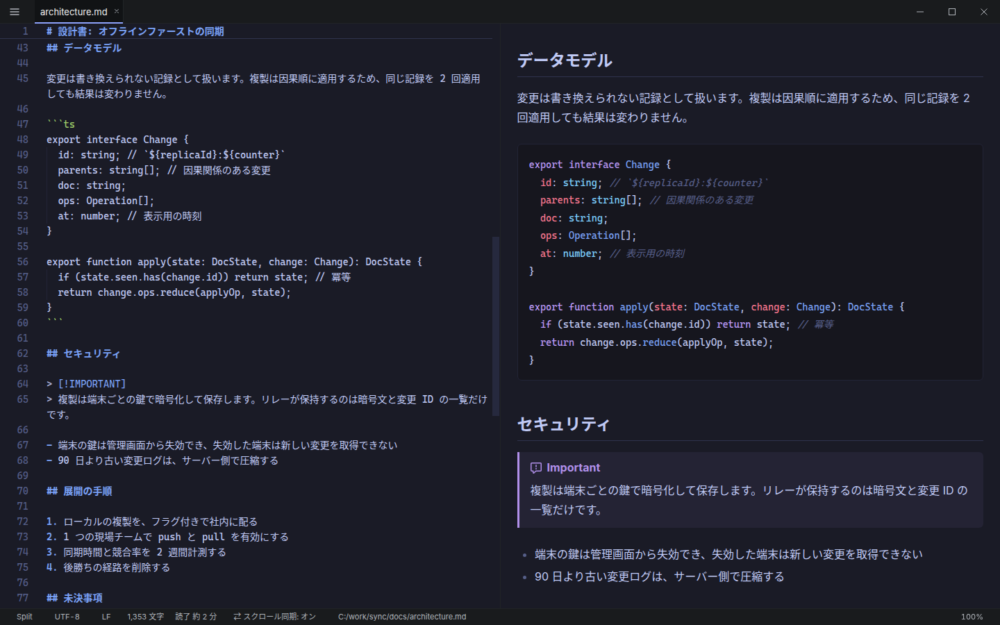</td>
  </tr>
  <tr>
    <td><b>読む。</b> アウトライン、読みやすい行の長さ、ダーク表示で、長い文書も楽に読めます。</td>
    <td><b>必要なら、そのまま直す。</b> キー 1 つで Split に切り替わり、書いた内容がすぐプレビューに反映されます。</td>
  </tr>
  <tr>
    <td width="50%">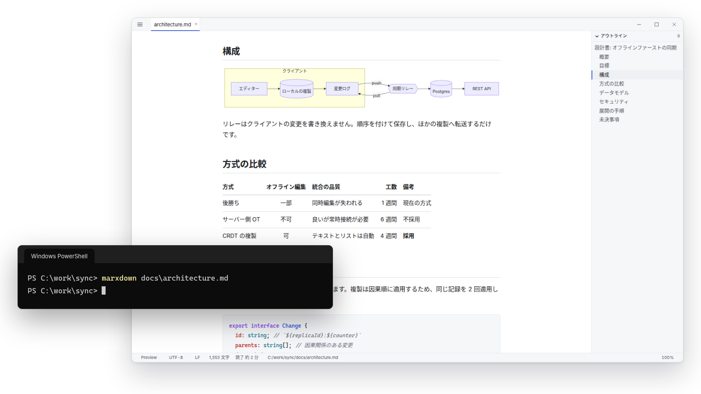</td>
    <td width="50%">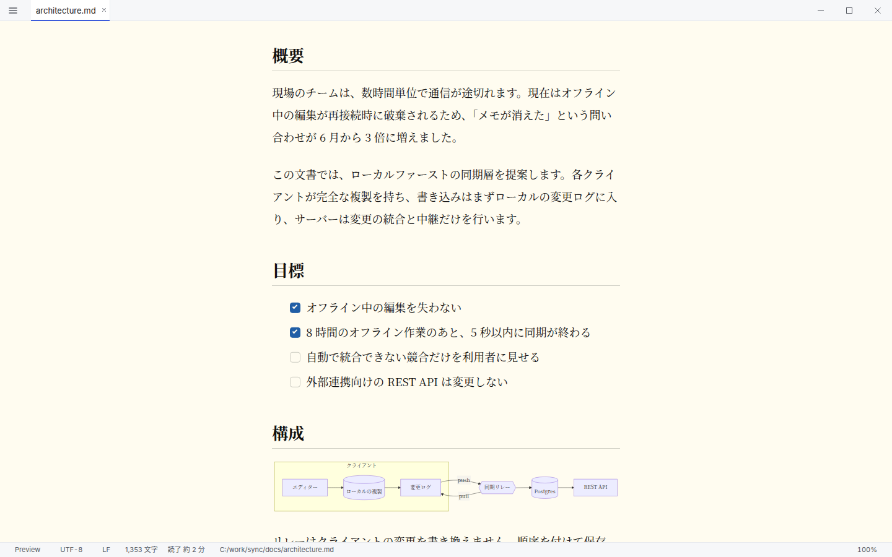</td>
  </tr>
  <tr>
    <td><b>ターミナルから開く。</b> プロンプトはすぐに戻ります。</td>
    <td><b>自分好みに。</b> フォント・文字サイズ・行間・本文幅を調整できます。</td>
  </tr>
</table>

## 特徴

### 読む

- **読むための表示で開く。** 余白・行間・本文幅を整えたタイポグラフィで、長い文書も読みやすく表示します
- **開発者が書くものを、そのまま表示する。** 表、シンタックスハイライト付きのコード、数式（KaTeX）、図（Mermaid）、GitHub のアラート（`> [!NOTE]`）、タスクリスト、脚注
- **迷わない。** アウトラインから見出しへ移動でき、プレビュー内も検索できます

### すぐ開く

- **ターミナルから開ける。** `marxdown README.md` と打てば、すぐに読み始められます。cmd.exe / PowerShell / Git Bash のどこからでも、プロンプトはすぐに戻ります
- **2 つ目からはタブで開く。** 一度起動するとタスクトレイで待機します。待機中は CPU をほとんど使いません
- **ダブルクリックでも開ける。** `.md` / `.markdown` に関連付けられ、フォルダーの右クリックメニューに「Marxdown で開く」が加わります

### 必要なときに書く

- **読むから書くまで、キー 1 つ。** Preview / Edit / Split を切り替えられます
- **保存しても、変えたところしか変わらない。** 改行コード・BOM・末尾の改行も、開いたときのまま保ちます
- **ファイルの変化に追従する。** ほかのアプリ（や AI エージェント）がファイルを書き換えると、自動で再読み込みします

### フォルダーごと扱う

- **フォルダーを開ける。** `marxdown docs/` で、ファイル一覧と一緒に開きます
- **名前で探せる。** <kbd>Ctrl</kbd>+<kbd>P</kbd> でファイルを検索し、<kbd>Ctrl</kbd>+<kbd>Shift</kbd>+<kbd>P</kbd> のコマンドパレットからすべての操作を実行できます

### 長い文書を、快適に読むために

Markdown は、一瞬見るだけではなく、何分、何十分と読むことがあります。
だから、フォントや行間、本文幅にこだわっています。

- 本文とコードのフォント、文字サイズ、行間、本文幅、表の罫線を調整できます
- ライト / ダーク / Windows の設定に合わせる、から選べます
- **50 種類の組み込み配色** に加え、`themes` フォルダーに CSS ファイルを置くだけで自分の配色を追加できます

<table>
  <tr>
    <td width="33%">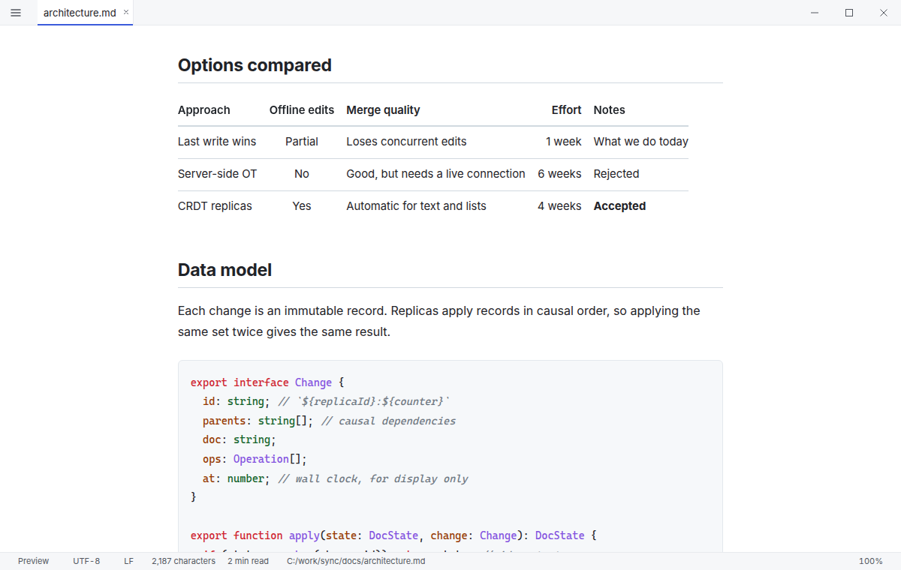</td>
    <td width="33%">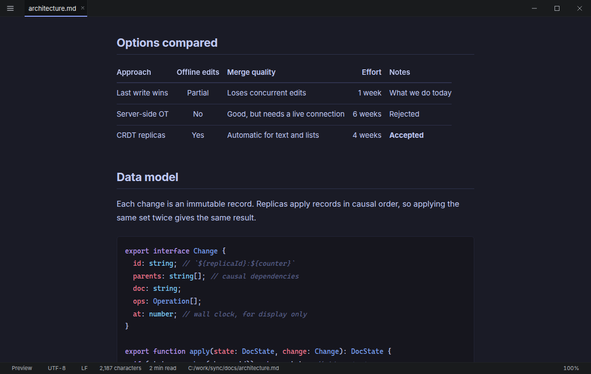</td>
    <td width="33%">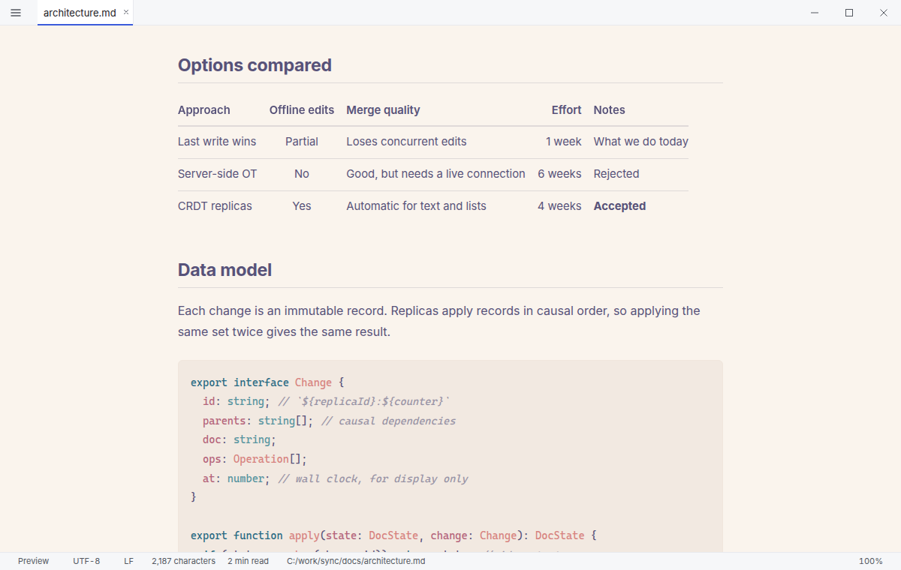</td>
  </tr>
  <tr>
    <td width="33%">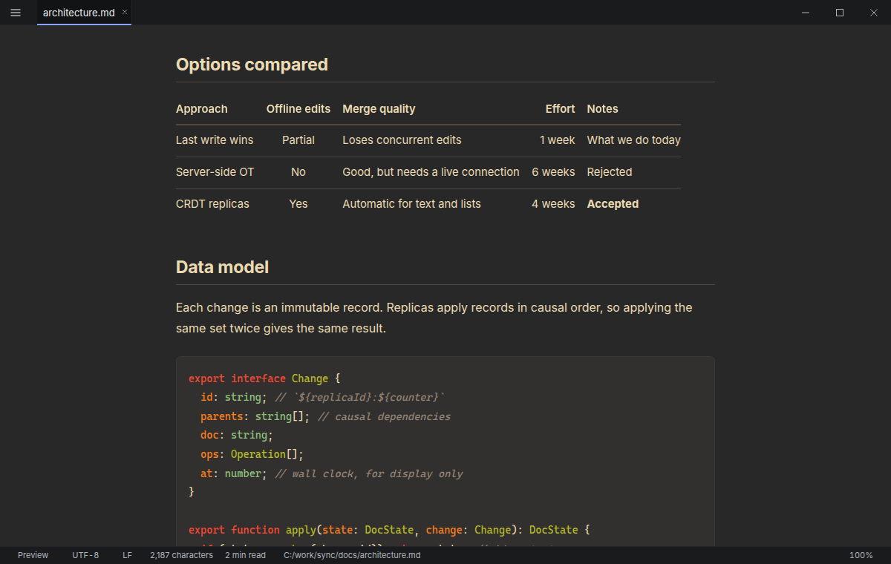</td>
    <td width="33%">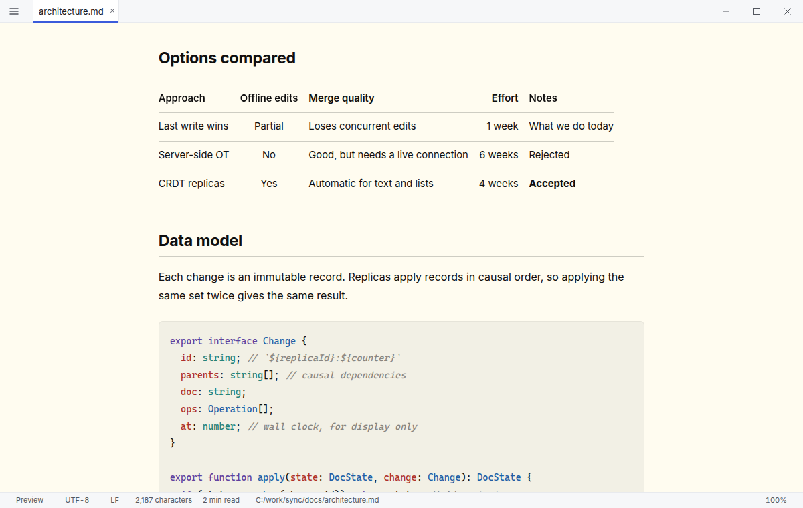</td>
    <td width="33%">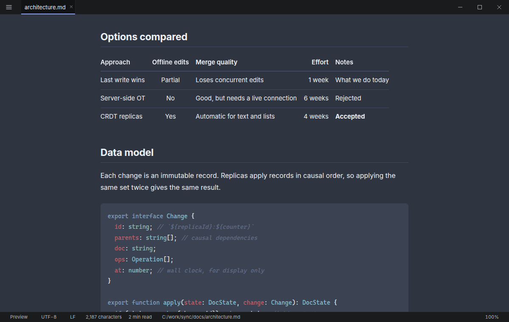</td>
  </tr>
</table>

### ほかにも

- 表示している文書を HTML / PDF として書き出せます
- `marp: true` を書いた文書は、[Marp](https://marp.app/) のスライドとして表示します
- 定義リスト、マーカー、上付き・下付き文字などは設定で有効にできます
- 画面の表示は日本語と英語に対応しています（既定では Windows の表示言語に合わせます）
- 新しいバージョンが出ると、アプリ内でお知らせします

## ほかのツールとの違い

どのツールも、それぞれの目的では優れています。この表は優劣ではなく、何を中心に作られているかの違いです。

| | Marxdown | VS Code | Typora | Obsidian |
| --- | --- | --- | --- | --- |
| 中心にあるもの | Markdown ファイルを読むこと（と、ちょっとした編集） | コードを書いてデバッグすること | Markdown を書くこと（WYSIWYG） | リンクでつながるノートの知識ベース |
| ファイル 1 つをそのまま開く | ✓ | ✓ | ✓ | ファイルは保管庫（Vault）に置く |
| 編集の方式 | ソースのエディター（Monaco）と Preview / Split | ソースのエディターとプレビューの区画 | WYSIWYG | ライブプレビュー・ソース・閲覧の表示 |
| 対応 OS | Windows のみ | Windows・macOS・Linux | Windows・macOS・Linux | Windows・macOS・Linux・モバイル |
| 価格 | 無料・オープンソース（MIT） | 無料 | 有料（買い切り。試用期間あり） | 無料（商用ライセンスは任意） |

長い文章を書くなら Typora、ノートのつながりを育てるなら Obsidian、コードベースの中で暮らすなら VS Code が合っています。
Marxdown は、目の前のファイルを開いて読むためのアプリです。

## インストール

1. [**Releases**](https://github.com/antimacho612/marxdown/releases/latest) から `Marxdown_<バージョン>_x64-setup.exe` をダウンロードします
2. 実行します。管理者権限は不要です（`%LOCALAPPDATA%\Marxdown` にインストールされます）
3. 最後の「ターミナルから marxdown コマンドを使えるようにしますか？」で **「はい」** を選びます

これで完了です。`.md` をダブルクリックするか、`marxdown README.md` と入力してください。

> [!NOTE]
> インストーラーには現在コード署名をしていないため、SmartScreen の警告（「Windows によって PC が保護されました」）が表示されることがあります。
> 「詳細情報」→「実行」の順に選ぶと、インストールを続けられます。

新しいバージョンが出ると、アプリ内に通知が表示され、「更新して再起動」で入れ替わります。
変更内容は [CHANGELOG](CHANGELOG.md) にあります。

<details>
<summary>WebView2 ランタイムについて</summary>

<br />

Windows 11 には標準で入っています。
入っていない環境（一部の Windows 10）では、インストール中に自動でダウンロードするため、インターネット接続が必要です。

</details>

<details>
<summary>サイレントインストール</summary>

<br />

`/S` で確認なしにインストールします。`/ADDTOPATH` を付けると、PATH にも追加します。
更新するときは、前回の選択を引き継ぎます。

```powershell
.\Marxdown_<バージョン>_x64-setup.exe /S /ADDTOPATH
```

</details>

<details>
<summary>アンインストール</summary>

<br />

「設定 > アプリ > インストールされているアプリ」から Marxdown をアンインストールします。
ファイルの関連付けと PATH は元に戻ります。
設定と最近開いたファイルの履歴も削除する場合は、アンインストール画面で「アプリのデータを削除」にチェックを入れてください。

</details>

## コマンドライン

```bash
marxdown README.md                 # ファイルを開く
marxdown README.md CHANGELOG.md    # 複数のファイルをタブで開く
marxdown docs/                     # フォルダーをファイル一覧と一緒に開く
marxdown -m split notes.md         # 表示モードを指定して開く: preview | edit | split
llm "設計案を出して" | marxdown -   # 標準入力の内容を無題の文書として開く
marxdown --help
```

標準入力から開いた文書は、まだファイルとして保存されていません。残したいときは <kbd>Ctrl</kbd>+<kbd>Shift</kbd>+<kbd>S</kbd>（名前を付けて保存）で保存してください。
Windows PowerShell 5.1 からパイプで渡すと、ASCII 以外の文字が `?` に置き換わります（PowerShell の仕様です）。PowerShell 7.4 以降では起きません。

> [!TIP]
> `✕` でウィンドウを閉じても、Marxdown はタスクトレイで待機しています。次の `marxdown` がすぐに開くのはこのためです。
> 完全に終了するには、<kbd>Ctrl</kbd>+<kbd>Q</kbd> を押すか、タスクトレイのメニューから「終了」を選んでください。

### 主なショートカット

| キー | 動作 |
| --- | --- |
| <kbd>Ctrl</kbd>+<kbd>Shift</kbd>+<kbd>V</kbd> | Preview と Edit を切り替える |
| <kbd>Ctrl</kbd>+<kbd>\</kbd> | Split（エディターとプレビューを左右に並べる） |
| <kbd>Ctrl</kbd>+<kbd>P</kbd> | フォルダー内のファイルを検索して開く |
| <kbd>Ctrl</kbd>+<kbd>Shift</kbd>+<kbd>P</kbd> | コマンドパレット |
| <kbd>Ctrl</kbd>+<kbd>,</kbd> | 設定 |
| <kbd>Ctrl</kbd>+<kbd>Q</kbd> | 終了 |

すべてのショートカットは [キーボードショートカット](docs/keybindings.md)、記法と設定の一覧は [ガイド](https://antimacho612.github.io/marxdown/guide/) にあります。

## プライバシーとセキュリティ

- **ファイルは手元から出ない。** アカウント登録はなく、利用状況の送信（テレメトリ）もありません。文書をどこかへアップロードすることもありません
- **オフラインで使える。** Mermaid の図や数式を含め、表示の処理はすべて手元で行います。ただし、文書の中に `https://` の画像があれば、ブラウザと同じように表示のために取得します
- **更新の確認。** 起動時とウィンドウを前面に出したときに、1 日 1 回まで GitHub の Releases に新しいバージョンを問い合わせます。開いているファイルの情報は含みません。設定の「新しいバージョンを自動で確認する」（`update.autoCheck`）で止められます
- **自分で書いていない Markdown を前提に作っている。** 文書に埋め込まれたスクリプトは実行せず、リンクを踏んでもアプリ内で別のページへ移動しません。開いたファイルのフォルダーの外にあるファイルは、許可しない限り読み込みません

脆弱性の報告は [SECURITY.md](SECURITY.md) を参照してください。

## 速さについて

Marxdown は、起動時間の予算を決めて作っています。初回の起動は **600ms**、タスクトレイで待機している状態からは **120ms** が目標です。
使う側から見ると、フル IDE の初期化を待たずに Markdown を開けて、2 つ目以降のファイルはすぐにタブで現れる、ということです。

これは起動のベンチマーク（`pnpm bench:boot`。release ビルドで、起動の各段階の中央値を取る）で確かめている設計上の目標で、どの PC でもこの時間になることを保証するものではありません。
計測の方法は [CONTRIBUTING.md](CONTRIBUTING.md#計測) にあります。

## 技術的な詳細


[](https://github.com/antimacho612/marxdown/actions/workflows/ci.yml)
[](https://github.com/antimacho612/marxdown/releases)
[](LICENSE)

- **アプリの土台:** Tauri 2（Rust）と WebView2。単一インスタンス、タスクトレイ、文字コード・改行コード・BOM を保つファイルの読み書き
- **UI:** Svelte 5 と TypeScript
- **Markdown の処理:** markdown-it で変換し、DOMPurify でサニタイズしたうえで、厳しい Content Security Policy の下で表示
- **エディター:** Monaco。初めて編集するときに読み込む
- **遅延読み込み:** エディター・Mermaid・KaTeX・シンタックスハイライトは必要になるまで読み込まない。起動に必要なバンドルの大きさは CI で予算を検査している

ビルド手順・検査・計測・コードの構成は [CONTRIBUTING.md](CONTRIBUTING.md) にあります。

## フィードバック

不具合の報告と機能の要望は [Issue](https://github.com/antimacho612/marxdown/issues/new/choose) で受け付けています。
毎日 Markdown を読む方からの「ここが引っかかる」という声は、特に参考になります。

## ライセンス

[MIT](LICENSE)
