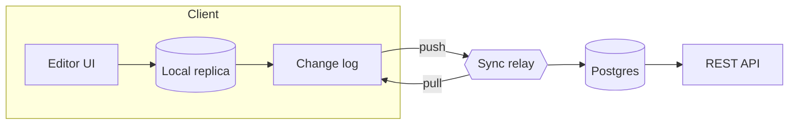

# Architecture: Offline-first Sync

> [!NOTE]
> Draft prepared with an AI assistant from the design review on 2026-09-24. Decisions are marked as **Accepted** or **Open**.

## Summary

Field teams lose connectivity for hours at a time. Today every edit made offline is discarded on reconnect, and support tickets about "lost notes" have tripled since June.

This document proposes a local-first sync layer: every client keeps a full replica, writes go to a local log first, and the server only merges and relays changes.

## Goals

- [x] Edits made offline are never lost
- [x] Reconnecting after 8 hours of offline work syncs in under 5 seconds
- [ ] Conflicts are shown to the user only when they cannot be merged automatically
- [ ] No change to the existing REST API for third-party integrations

## Architecture



The relay never rewrites a client's changes. It orders them, persists them, and forwards them to other replicas.

## Options compared

| Approach | Offline edits | Merge quality | Effort | Notes |
| --- | :---: | --- | ---: | --- |
| Last write wins | Partial | Loses concurrent edits | 1 week | What we do today |
| Server-side OT | No | Good, but needs a live connection | 6 weeks | Rejected |
| CRDT replicas | Yes | Automatic for text and lists | 4 weeks | **Accepted** |

## Data model

Each change is an immutable record. Replicas apply records in causal order, so applying the same set twice gives the same result.

```ts
export interface Change {
  id: string; // `${replicaId}:${counter}`
  parents: string[]; // causal dependencies
  doc: string;
  ops: Operation[];
  at: number; // wall clock, for display only
}

export function apply(state: DocState, change: Change): DocState {
  if (state.seen.has(change.id)) return state; // idempotent
  return change.ops.reduce(applyOp, state);
}
```

## Security

> [!IMPORTANT]
> Replicas are encrypted at rest with a per-device key. The relay stores ciphertext and the list of change ids only.

- Device keys are revoked from the admin console; a revoked device cannot pull new changes
- Change logs older than 90 days are compacted on the server

## Rollout

1. Ship the local replica behind a flag to internal users
2. Enable push and pull for one field team
3. Measure sync time and conflict rate for two weeks
4. Remove the old last-write-wins path

## Open questions

- How large can a replica grow on low-end tablets?
- Do we need per-field conflict UI, or is per-document enough?
