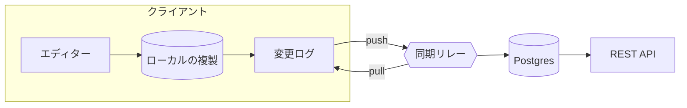

# 設計書: オフラインファーストの同期

> [!NOTE]
> 2026-09-24 の設計レビューをもとに、AI アシスタントと作成した草案です。決定事項には **採用** / **未決** を付けています。

## 概要

現場のチームは、数時間単位で通信が途切れます。現在はオフライン中の編集が再接続時に破棄されるため、「メモが消えた」という問い合わせが 6 月から 3 倍に増えました。

この文書では、ローカルファーストの同期層を提案します。各クライアントが完全な複製を持ち、書き込みはまずローカルの変更ログに入り、サーバーは変更の統合と中継だけを行います。

## 目標

- [x] オフライン中の編集を失わない
- [x] 8 時間のオフライン作業のあと、5 秒以内に同期が終わる
- [ ] 自動で統合できない競合だけを利用者に見せる
- [ ] 外部連携向けの REST API は変更しない

## 構成



リレーはクライアントの変更を書き換えません。順序を付けて保存し、ほかの複製へ転送するだけです。

## 方式の比較

| 方式 | オフライン編集 | 統合の品質 | 工数 | 備考 |
| --- | :---: | --- | ---: | --- |
| 後勝ち | 一部 | 同時編集が失われる | 1 週間 | 現在の方式 |
| サーバー側 OT | 不可 | 良いが常時接続が必要 | 6 週間 | 不採用 |
| CRDT の複製 | 可 | テキストとリストは自動 | 4 週間 | **採用** |

## データモデル

変更は書き換えられない記録として扱います。複製は因果順に適用するため、同じ記録を 2 回適用しても結果は変わりません。

```ts
export interface Change {
  id: string; // `${replicaId}:${counter}`
  parents: string[]; // 因果関係のある変更
  doc: string;
  ops: Operation[];
  at: number; // 表示用の時刻
}

export function apply(state: DocState, change: Change): DocState {
  if (state.seen.has(change.id)) return state; // 冪等
  return change.ops.reduce(applyOp, state);
}
```

## セキュリティ

> [!IMPORTANT]
> 複製は端末ごとの鍵で暗号化して保存します。リレーが保持するのは暗号文と変更 ID の一覧だけです。

- 端末の鍵は管理画面から失効でき、失効した端末は新しい変更を取得できない
- 90 日より古い変更ログは、サーバー側で圧縮する

## 展開の手順

1. ローカルの複製を、フラグ付きで社内に配る
2. 1 つの現場チームで push と pull を有効にする
3. 同期時間と競合率を 2 週間計測する
4. 後勝ちの経路を削除する

## 未決事項

- 性能の低いタブレットで、複製はどこまで大きくなるか
- 競合の画面はフィールド単位で要るか、文書単位で足りるか
